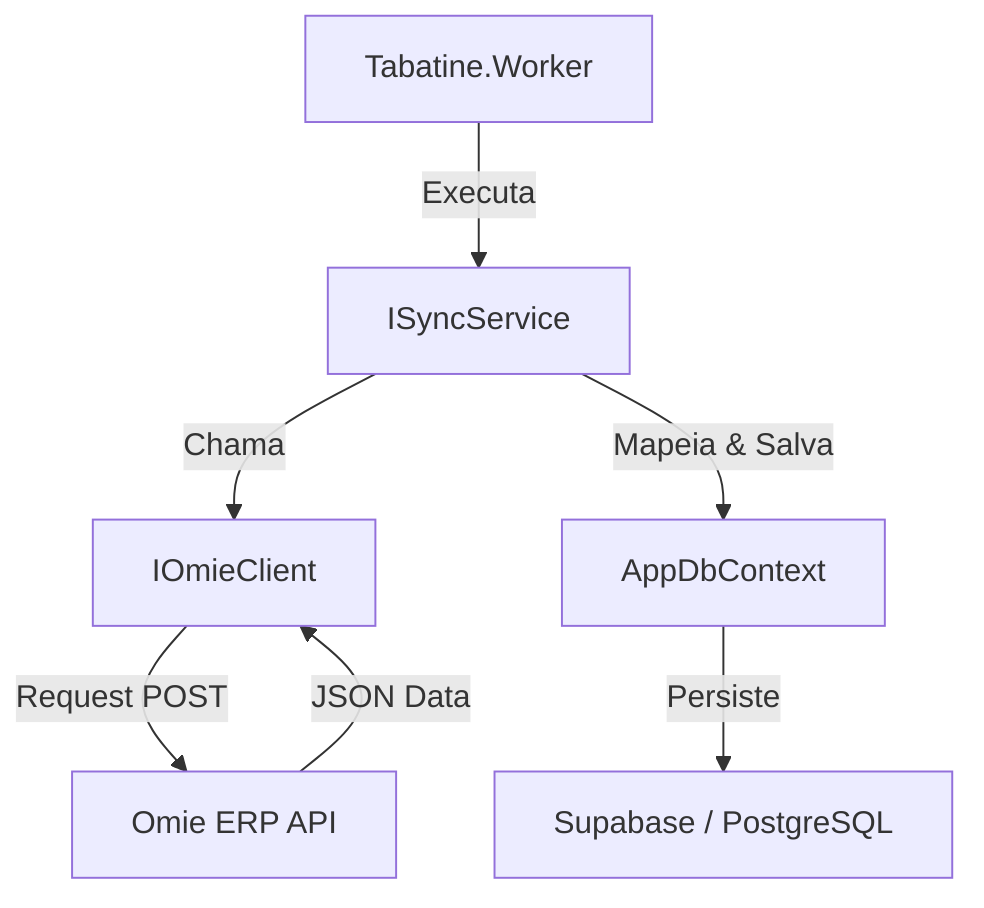

# Tabatine — Regras do Workspace (Engine)

## Visão Geral do Projeto

Tabatine Engine é uma solução de sincronização com o **Omie ERP** construída com **.NET 10**. O objetivo principal é manter um banco de dados local (Supabase/PostgreSQL) sincronizado com os dados do Omie para permitir consultas rápidas e integração com outros sistemas sem sobrecarregar a API do Omie ou sofrer com seus limites de taxa.

---

## Arquitetura da Solução

O projeto segue uma arquitetura limpa (Clean Architecture) dividida em:

- **Tabatine.Core**: Contém as entidades de domínio, interfaces e lógica de negócio central. As entidades geralmente herdam de `OmieEntityBase`.
- **Tabatine.Infrastructure**: Implementação dos serviços de dados, repositórios e integração com APIs externas.
- **Tabatine.Omie.Client**: Biblioteca cliente para comunicação com a API REST/JSON do Omie.
- **Tabatine.Worker**: Serviço em segundo plano (Background Service) que orquestra as tarefas de sincronização.

### Fluxo de Sincronização



---

## API Omie — Referência Rápida

### Protocolo de Comunicação
Todas as APIs do Omie usam **JSON via HTTP POST**. A `APP_KEY` e `APP_SECRET` são obrigatórias em todas as chamadas.

### Limites e Boas Práticas
- **Rate Limit**: Respeitar o limite de 240 req/min e bloqueio de 60s por registro (ver `omie-validator.md`).
- **Paginação**: Usar `registros_por_pagina` (recomendado: 50 a 100) e iterar sobre `total_de_paginas`.
- **Incremental**: Sempre que possível, usar o campo `filtrar_por_data_de` ou similar para trazer apenas alterações desde a última sincronização.

---

## Estrutura do Projeto

```
src/
├── Tabatine.Core/           # Domínio e Entidades
│   └── Entities/            # Classes POCO mapeadas para o DB
├── Tabatine.Infrastructure/ # Implementação técnica
│   ├── Data/                # EF Core DbContext e Migrations
│   └── Services/            # Serviços de Sincronização (ClienteSyncService, etc)
├── Tabatine.Omie.Client/    # Cliente da API Omie
│   └── Models/              # DTOs de Request/Response da Omie
└── Tabatine.Worker/         # Host do serviço de background
```

---

## Problemas Conhecidos e Débitos Técnicos
- **Mapeamento de Impostos**: Verifique sempre o `ItemPedido` para campos como IBS, CBS e CFOP.
- **Log de Sincronização**: Acompanhe o status na tabela `Logs` ou use o Serilog configurado no Worker.