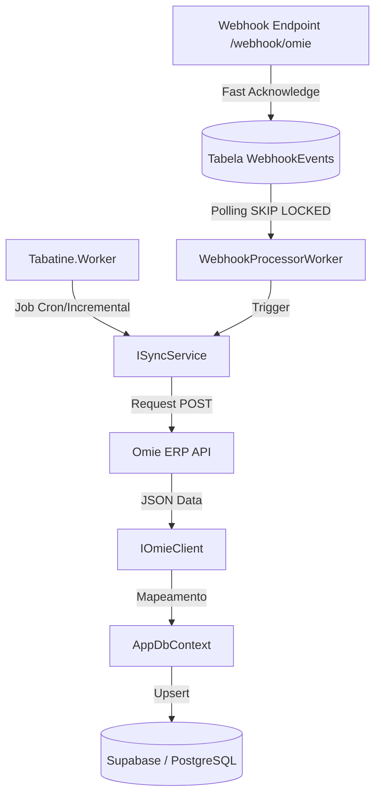

# Tabatine Engine - Omie Sync Service

O **Tabatine Engine** é o núcleo de processamento e sincronização de dados entre o **Omie ERP** e o banco de dados local (Supabase/PostgreSQL). Desenvolvido em **.NET 10**, ele garante que as informações de vendas, clientes, produtos e notas fiscais estejam sempre atualizadas para consumo rápido pelo frontend.

## 🏗️ Arquitetura da Solução

O projeto segue os princípios de **Clean Architecture**, dividido em quatro camadas principais:

- **Tabatine.Core**: Contém as entidades de domínio, interfaces base (`OmieEntityBase`) e lógica de negócio central.
- **Tabatine.Infrastructure**: Implementação do `AppDbContext` (EF Core), repositórios de dados, configurações de mapeamento e serviços de persistência.
- **Tabatine.Omie.Client**: Cliente de integração com a API do Omie, contendo os modelos de Request/Response e a lógica de comunicação HTTP.
- **Tabatine.Worker**: Serviço de segundo plano (Background Service) que orquestra as tarefas de sincronização e expõe endpoints para recebimento de **Webhooks**.

## 🚀 Tecnologias Utilizadas

- **Framework**: [.NET 10 SDK](https://dotnet.microsoft.com/download/dotnet/10.0)
- **ORM**: [Entity Framework Core](https://learn.microsoft.com/en-us/ef/core/)
- **Banco de Dados**: [PostgreSQL](https://www.postgresql.org/) (Hospedado no [Supabase](https://supabase.com/))
- **Logs**: [Serilog](https://serilog.net/) (com sinks para Console e Tabela de Logs no DB)
- **Monitoramento**: Health Checks integrados para status do banco e conectividade.

## 🔄 Fluxo de Sincronização



## 🛠️ Como Iniciar

### Pré-requisitos
- .NET 10 SDK instalado.
- Instância do PostgreSQL (ou projeto Supabase) ativa.

### Configuração
1. Clone o repositório.
2. Configure as variáveis de ambiente no `appsettings.json` ou `.env`:
   ```json
   {
     "ConnectionStrings": {
       "DefaultConnection": "Host=your_host;Database=postgres;Username=postgres;Password=your_password"
     },
     "OmieApi": {
       "AppKey": "seu_app_key",
       "AppSecret": "seu_app_secret"
     }
   }
   ```

### Execução
1. Restaure as dependências:
   ```bash
   dotnet restore
   ```
2. Aplique as migrações ao banco de dados:
   ```bash
   dotnet ef database update --project src/Tabatine.Infrastructure --startup-project src/Tabatine.Worker
   ```
3. Execute o Worker:
   ```bash
   dotnet run --project src/Tabatine.Worker
   ```

## 📡 Integração de Webhooks (Processamento Assíncrono)

O Worker expõe o endpoint `/webhook/omie` para receber notificações em tempo real do Omie.
Para respeitar o curto *timeout* da Omie de 7 segundos e evitar o bloqueio da fila original:
1. **Ingestão (Fast Acknowledge)**: O endpoint apenas valida a estrutura, insere o payload bruto na tabela `WebhookEvents` do banco de dados e retorna `200 OK` instantaneamente.
2. **Processamento (Background Worker)**: O serviço especializado `WebhookProcessorWorker` varre a fila no banco de dados com concorrência segura (`SELECT ... FOR UPDATE SKIP LOCKED`), processando os eventos de **Vendas** e **Notas Fiscais**, alterando o status para `Processed` ou `Failed` sem derrubar a aplicação.

## 📝 Logs e Auditoria

Todas as operações críticas são registradas na tabela `Logs` do banco de dados através da entidade `LogEntry`, permitindo rastreabilidade total de falhas na sincronização.
