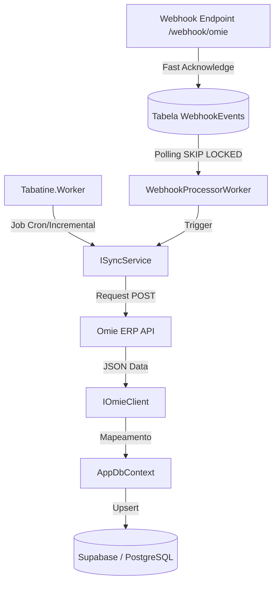
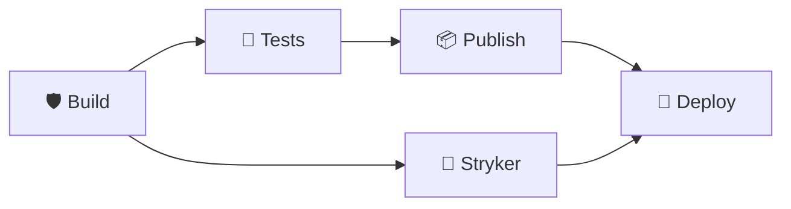
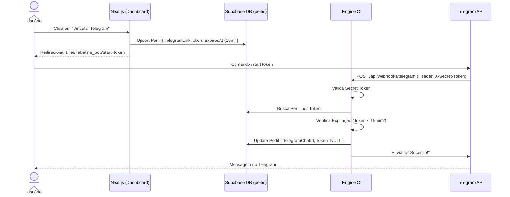

# Tabatine Engine - Omie Sync Service


O **Tabatine Engine** é o núcleo de processamento e sincronização de dados entre o **Omie ERP** e o banco de dados local (Supabase/PostgreSQL). Desenvolvido em **.NET 10**, ele garante que as informações de vendas, clientes, produtos, notas fiscais, vendedores, contas correntes e outros 10+ módulos vitais estejam sempre atualizadas para consumo rápido pelo frontend.

## 🏗️ Arquitetura da Solução

O projeto segue os princípios de **Clean Architecture**, dividido em quatro camadas principais:

- **Tabatine.Core**: Contém as entidades de domínio, interfaces base (`OmieEntityBase`) e lógica de negócio central.
- **Tabatine.Infrastructure**: Implementação do `AppDbContext` (EF Core), repositórios de dados, configurações de mapeamento e serviços de persistência.
- **Tabatine.Omie.Client**: Cliente de integração com a API do Omie, contendo os modelos de Request/Response e a lógica de comunicação HTTP.
- **Tabatine.Worker**: Serviço de segundo plano (Background Service) que orquestra as tarefas de sincronização e expõe endpoints para recebimento de **Webhooks**.

## 🚀 Tecnologias Utilizadas

- **Framework**: [.NET 10 SDK](https://dotnet.microsoft.com/download/dotnet/10.0)
- **ORM**: [Entity Framework Core](https://learn.microsoft.com/en-us/ef/core/)
- **Banco de Dados**: [PostgreSQL](https://www.postgresql.org/) (Hospedado no [Supabase](https://supabase.com/))
- **Logs**: [Serilog](https://serilog.net/) (com sinks para Console e Tabela de Logs no DB)
- **Monitoramento**: Health Checks integrados para status do banco e conectividade.
- **Documentação API**: [Scalar](https://github.com/scalar/scalar) (disponível em `/scalar/v1`).
- **Containerização**: [Docker](https://www.docker.com/) com suporte a multi-stage builds e Docker Compose.

## 🔄 Fluxo de Sincronização



## ⛓️ Esteira de CI/CD (Pipeline)

O projeto utiliza uma esteira modularizada no GitHub Actions para garantir a qualidade e resiliência de cada release. O fluxo é dividido em jobs independentes:



1.  **🛡️ Build**: Validação de compilação de todos os projetos da solução.
2.  **🧪 Tests**: Execução de testes integrados e unitários com relatórios de cobertura (Code Coverage).
3.  **🧬 Stryker**: Testes de mutação para assegurar a eficácia da suíte de testes.
4.  **📦 Publish**: Preparação do artefato final para o ambiente de runtime.
5.  **🚀 Deploy**: Implantação automatizada no Azure Web App (somente via branch `main`).

Para mais detalhes sobre a evolução deste fluxo, consulte a [Issue #46](https://github.com/JonathanBenicio/Tabatine-Engine/issues/46).

## 🛠️ Como Iniciar

### Pré-requisitos
- .NET 10 SDK instalado.
- Instância do PostgreSQL (ou projeto Supabase) ativa.

### Configuração
1. Clone o repositório.
2. Crie um arquivo `.env.local` na raiz do projeto `src/Tabatine.Worker` (ou use variáveis de ambiente):
   ```env
   # Banco de Dados (Supabase)
   ConnectionStrings__DefaultConnection="Host=...;Database=postgres;Username=postgres;Password=..."

   # Omie API
   Omie__AppKey="seu_app_key"
   Omie__AppSecret="seu_app_secret"

   # Telegram Bot
   Telegram__BotToken="seu_bot_token"
   Telegram__WebhookUrl="https://seu-dominio.com"
   Telegram__WebhookSecret="token_de_seguranca_webhooks"
   ```

### Execução
1. Restaure as dependências:
   ```bash
   dotnet restore
   ```
2. Aplique as migrações (Opcional - o Worker aplica automaticamente no startup):
   ```bash
   dotnet ef database update --project src/Tabatine.Infrastructure --startup-project src/Tabatine.Worker
   ```
3. Execute o Worker:
   ```bash
   dotnet run --project src/Tabatine.Worker
   ```

## 🧪 Testes de Integração (Pré-requisito: Docker)

O projeto utiliza **Testcontainers** para garantir a integridade da sincronização com um banco de dados PostgreSQL real em um ambiente isolado.

- **Requisito**: O [Docker Desktop](https://www.docker.com/products/docker-desktop/) deve estar instalado e **em execução** para rodar a suíte de testes.
- **Timeouts**: Devido à complexidade da rota de sincronização global (14 módulos), os testes de integração possuem um timeout estendido de **5 minutos**.
  ```bash
  dotnet test src/TabatineEngine.sln --collect:"XPlat Code Coverage"
  ```

### 🧬 Testes de Mutação (Stryker.NET)

O projeto utiliza o **Stryker.NET** para avaliar a qualidade da suíte de testes através de mutações no código-fonte.
- **Execução**:
  ```bash
  dotnet tool restore
  dotnet stryker --project src/Tabatine.Infrastructure/Tabatine.Infrastructure.csproj
  ```
- **Threshold**: O pipeline de CI exige uma pontuação de mutação superior a **50%**.

## 📖 Documentação Interativa (Scalar)

O Engine expõe uma interface **Scalar** moderna para exploração da API em vez do Swagger tradicional.
- **URL Local**: `http://localhost:5000/scalar/v1`
- Através dela, você pode testar manualmente os endpoints de Webhook e Sincronização.

## 📡 Integração de Webhooks (Processamento Assíncrono)

O Worker expõe o endpoint `/webhook/omie` para receber notificações em tempo real do Omie.
Para respeitar o curto *timeout* da Omie de 7 segundos e evitar o bloqueio da fila original:
1. **Ingestão (Fast Acknowledge)**: O endpoint apenas valida a estrutura, insere o payload bruto na tabela `WebhookEvents` do banco de dados e retorna `200 OK` instantaneamente.
2. **Processamento (Background Worker)**: O serviço especializado `WebhookProcessorWorker` varre a fila no banco de dados com concorrência segura (`SELECT ... FOR UPDATE SKIP LOCKED`), processando os eventos de **Vendas**, **Notas Fiscais**, **Clientes**, **Produtos**, **Vendedores** e **Contas Correntes**.
3. **Debouncing de Estoque**: Para prevenir sobrecarga em movimentações massivas, as notificações de `MovimentacaoEstoque` e `AjusteEstoque` possuem um **agrupamento (debouncing) de 10 segundos**. Múltiplas alterações no mesmo produto dentro desta janela são consolidadas em uma única sincronização.
4. **De-queue Dinâmico**: O worker implementa uma lógica de "Vazão Máxima", onde ignora o intervalo de polling se houver carga pendente no banco, garantindo que a fila seja drenada o mais rápido possível através da propriedade `hasMore`.
5. **Retry com Backoff Exponencial**: Mensagens que falham (ex: erro temporário de rede ou trava de registro) são colocadas em estado `Failed` com um `NextRetryAt` calculado por exponenciação (2^tentativa minutos), até o limite de 3 tentativas, quando movem para `DeadLetter`.
6. **Resiliência de Clock Drift**: O polling utiliza uma margem de segurança de 1 segundo (`NOW() + INTERVAL '1 second'`) para compensar possíveis dessincronizações de relógio entre o Host e o container de banco de dados.

> [!NOTE]
> Consulte a [Documentação de Status dos Webhooks](docs/omie-webhooks-status.md) para a lista completa de tópicos suportados.

## 🔄 Gatilho de Sincronização Manual (Force Sync)

Caso queira forçar uma sincronização completa de todos os módulos Omie sem esperar pelo agendamento ou webhooks:
- **Endpoint**: `POST /api/sync/trigger`
- **Ação**: Agenda um evento do tipo `System.ManualSync` na fila de processamento, que será capturado pelo Worker e executará o `SyncManager` para todos os serviços registrados.

## 📝 Logs e Auditoria

Todas as operações críticas são registradas na tabela `Logs` do banco de dados através da entidade `LogEntry`, permitindo rastreabilidade total de falhas na sincronização.

## 📱 Vinculação Telegram (Deep Link)

O sistema permite que usuários autenticados vinculem sua conta do Telegram para receber notificações em tempo real através do bot **@Tabatine_bot**.

### Fluxo de Vinculação



A segurança é garantida através de:
- **Secret Token**: Validação do cabeçalho `X-Telegram-Bot-Api-Secret-Token`.
- **Expiração**: Tokens de vinculação expiram automaticamente após 15 minutos.
- **Isolamento**: O vínculo é feito na tabela `perfis`, desacoplado das entidades do ERP Omie.
